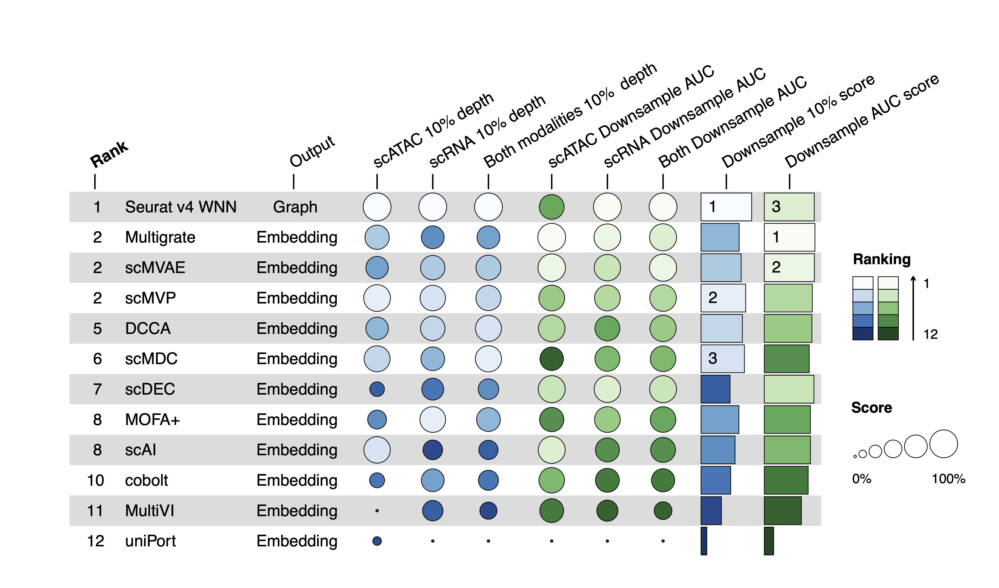

## Tutorial 3: Step by step tutorial to run SCMMIB pipeline for new single-cell multimodal datasets

### Step 1. Install the conda environment for benchmark methods in envs folder
Here is an example:
```Bash
conda env create -f benchmark_env.yaml
``` 

- Note: For tools with GPU accelaration, you should configure the appropriate nvidia driver version for your plaform. The GPU device applied in our benchmark is NVIDIA GeForce RTX 3090 and 1080Ti (scDEC only).

### Step2. Prepare the new input datasets.

We provide the processing codes to generate `h5ad`, `rds` and `h5Seurat` format input from `mtx` raw data input as well as `metadata.csv` file. For scRNA and scATAC multimodal datasets, we also provide the codes to generate "fragment.tsv" file from `bam` input for GAM prepartion in unpaired scRNA and scATAC diagonal integration.<br>  

Here is the demo for processing BMMC datasets: [script](../preprocessing_scripts/data_simulation/BMMC/data_preprocess_py.py)

- For robustness and scalability simulation, users can generated the simulation datasets with downloaded process datasets and `data_preprocess_R.R` for each dataset. 

- The conda environment for preprocess code is same as scmmib package: [scmmib_env file](https://github.com/bm2-lab/SCMMI_Benchmark/blob/main/scmmib_env.yml). 


### Step3. Run selected tasks and algorithms parrallelly by WDL workflow
A simple example is:
```Bash
java -jar cromwell-50.jar run -i inputs.json main.wdl
```
For more details, please refer to `README.md` manual in [wdl_worflow](../wdl_workflow/) folder.


### Step4. Calculate the metrics for selected tasks by `scmmib` package

The scmmib package is available at https://github.com/bm2-lab/SCMMI_Benchmark/. The installation manual is available at： https://github.com/bm2-lab/SCMMI_Benchmark/blob/main/README.md.

We provided three examples for differenet tasks at: https://github.com/bm2-lab/SCMMI_Benchmark/blob/main/docs/scmmib_demo.py. <br> 

The reference manual for all functions and parameters is available at: https://github.com/bm2-lab/SCMMI_Benchmark/blob/main/docs/scmmib_py_manual.md. <br>

### Step5. Plot summary table for benchmark methods
The metrics summary tables for all SCMMIB datasets are available at https://github.com/bm2-lab/SCMMI_Benchmark/tree/main/manuscript_figure_script_and_data/stage2_res/SCMMIB_metrics_final. Users can compare the peformance of methods in new dataset with our benchmark datasets with metrics scores in each dataset.<br> 

A simple example of output figure in our manuscript is here:
.

We also provided [a quick demo](https://github.com/bm2-lab/SCMMI_Benchmark/blob/main/docs/scmmib_summary_table_demo.r) and [function manuals](https://github.com/bm2-lab/SCMMI_Benchmark/blob/main/docs/scmmib_tab_r_manual.md) in `scmmib` package. 